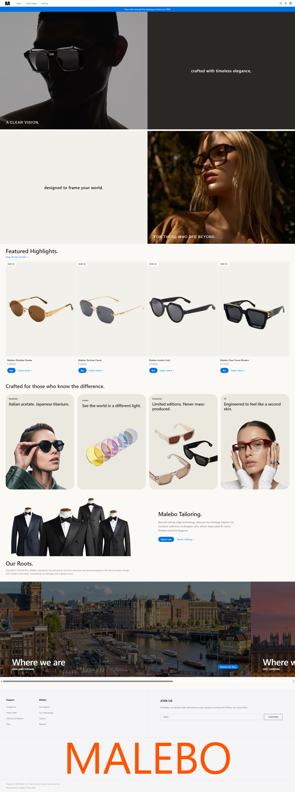

# Malebo Store

Malebo is a premium e-commerce store offering a collection of beautifully curated luxury items that you can wear, style, and stand out with. Start here to elevate your elegance with our premium suits and fine glasses, building your own signature look.

## Tech Stack

Built with a focus on simplicity and performance:

- HTML5
- CSS3
- JavaScript

## [Preview](https://malebo.online)

  

## About the Project

This project includes detailed guides explaining how it is built, structured, and set up locally:

- [Project Architecture](./docs/architecture.md) - High-level overview of the technologies, file structure, and project design.
- [Assets System](./docs/assets-system.md) - Deep dive into how CSS is structured with partials and how images are managed.
- [Local Setup](./docs/local-setup.md) - Step-by-step instructions for getting the project running locally and setting up the development environment.

## License

Licensed under the [MIT License](./LICENSE).
